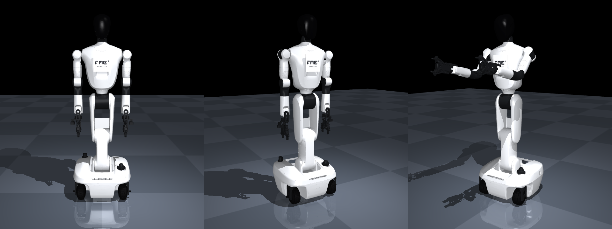

# 汇川机器人 MuJoCo 模型

由 `Rviz/src/franzi_description/urdf/wheel_robot_4.0.urdf`(与 Isaac Sim 的
`franzi.usd` 同源)自动生成的 MJCF。每个连杆两层:

- **视觉 = 真实 STL 网格**(group 1,无碰撞)——和 Isaac 里看到的一样;
- **碰撞 = 网格包围盒**(box,轮子是 y 轴 cylinder;group 3,viewer 默认
  隐藏)——接触求解快且稳。

运动学、关节限位、质量与完整惯量张量原样取自 URDF;固定关节的传感器连杆
(D435/D405/MID360/2D 雷达)合并进父体,各留一个同名 site(如
`head_d435`)和深蓝色的网格外壳。



## 文件

| 文件 | 说明 |
| --- | --- |
| `make_model.py` | 生成器:URDF + STL 包围盒 → `franzi.xml`(唯一需要维护的文件) |
| `make_logo.py` | 备贴图:`assets/fmc3_logo.png`(胸标,取自 Isaac)+ `logo.png`(汇川面板) |
| `franzi.xml` | 生成产物,30 关节 + 30 执行器 + freejoint 底座,勿手改 |
| `scene.xml` | 地板 + 灯光 + include franzi.xml,直接给 viewer / Renderer 用 |
| `franzi_sim_sdk.py` | 控制 SDK:与真机 `franzi_sdk.ArmClient` 同形的方法面 |
| `sdk_demo.py` | SDK 验证:MoveJ 轮询/双臂 14 维/夹爪/底盘三向/软急停 |
| `smoke_test.py` | 模型验证:静置不倒 → 双臂跟踪 → 夹爪闭合 → 轮驱前进 |

## 抽象要点

- **碰撞分组**:机器人 geom `contype=1 conaffinity=2` —— 与世界(地板等
  默认 geom)碰撞,自身之间永不碰撞(包围盒在每个关节处都互相重叠,开自碰
  撞必然爆炸)。组合场景时,环境物体用默认 contype/conaffinity 即可。
- **外观与 Isaac 一致**:默认移植 `IssacSim/paint.py` 的整套涂装——同一
  正则调色板(黑亮头罩、深灰关节连接件/传感器、橡胶黑轮胎、其余亮白)+
  胸口 FMC³ ROBOTICS 铭牌(复用 Isaac 的 `fmc3_logo.png` 原图,贴片位置
  同 `spawn_logo`:躯干前表面、60% 高度)。`python3 make_model.py --logo`
  切换为汇川品牌配色(躯干/底盘 logo 面板、升降柱橙色)。注意 default 里
  **不能**给 geom 写 rgba,显式 rgba 会盖掉所有 material 颜色;cube 贴图
  源图需预旋 90°(`make_logo.py` 已处理)。
- **执行器**:升降链(calf/thigh/waist)position kp=6000、force ±800——上身
  约 75 kg,重力失稳梯度 ~440 Nm/rad,伺服刚度必须显著高于它,否则堆叠会
  折叠;肩/肘 kp=1500,腕/头/舵向 kp=400,手指 kp=2000,轮子是 velocity
  执行器。力矩上限取 URDF effort(升降链除外)。
- **底盘**:三舵轮(前二后一),freejoint 底座落在轮触地高度
  (`keyframe "home"`),纯轮地摩擦驱动,不是运动学底座。

## 控制接口(SDK)

`franzi_sim_sdk.FranziSimClient` 复刻真机 SDK(`Rviz/src/franzi_sdk` 的
`ArmClient`)的方法面,对着真机写的控制代码换个构造函数就能在 MuJoCo 里跑:

- **厂商兼容子集**:`CommandJointPosition`(7 维单臂 / 14 维双臂,rad)、
  `MoveJ`(路径点,**非阻塞**,轮询 `GetMotionStatus`,同 RPC 语义)、
  `MoveStop` / `Home`(阻塞回零)、`GetCurJointPos` / `GetCurJointVel`
  (按机械单元 LEFTARM/RIGHTARM/WAIST/HEAD/双手,枚举值同厂商)、
  `GripperOpen/Close/SetPosition/ReadPosition`(0=全开,1=全闭)、
  `IsReady` / `SoftStop` / `AxisCount`。
- **仿真扩展**(真机走别的通道,已在 docstring 标明):
  `CommandBaseVelocity(vx, vy, wz)`——车体系速度经三舵轮逆解下发(对应
  ROS 栈的 /cmd_vel 接缝);`GetBasePose()`;`CommandUnitPosition`(腰/头);
  `step()`/`spin(秒)`——时间归调用方,无后台线程。

```python
from franzi_sim_sdk import FranziSimClient
robot = FranziSimClient()
robot.MoveJ([[-0.8, 0.3, 0, -1.2, 0, 0.3, 0]], side="left")
while robot.GetMotionStatus("left"):
    robot.step()
robot.GripperClose("left")
robot.CommandBaseVelocity(0.3, 0.0, 0.0); robot.spin(2.0)
```

## 验证(生成 + 冒烟测试)

```bash
cd Mujoco/franzi
python3 make_logo.py                  # 需要 Pillow + Noto CJK 字体
python3 make_model.py                 # 只用标准库,任何 python3 都行
python3 smoke_test.py                 # 需要 pip 包 mujoco(本机: conda env pistar)
python3 sdk_demo.py                   # SDK 全接口回归
```

期望输出:双臂目标误差 < 0.02 rad、2 s 直行 ≥ 0.3 m、底座姿态不倒。
交互查看:`python3 -m mujoco.viewer --mjcf scene.xml`。

## 已知取舍

- mesh 路径是仓库内相对路径(`../../Rviz/src/franzi_description/meshes`),
  franzi.xml 移出仓库单独用时需带上网格或改 `meshdir`。
- 碰撞包围盒比真实外形肥(尤其底盘含轮罩、腕部含相机支架),做接触密集的
  操作任务时可在 `make_model.py` 里对个别连杆换成更细的 capsule/多 box
  (viewer 里开 group 3 可以直观看到碰撞体)。
- 轮子按圆柱-地面摩擦滚动,舵向/轮速直接给执行器;与 ROS 栈的 holonomic
  `cmd_vel` 语义之间需要一层舵轮逆解(未做,迁移时归底盘驱动接缝)。
- URDF 里没有传动比与真实电机参数,kp/damping 是为稳定仿真调的,不代表
  真机伺服带宽。
